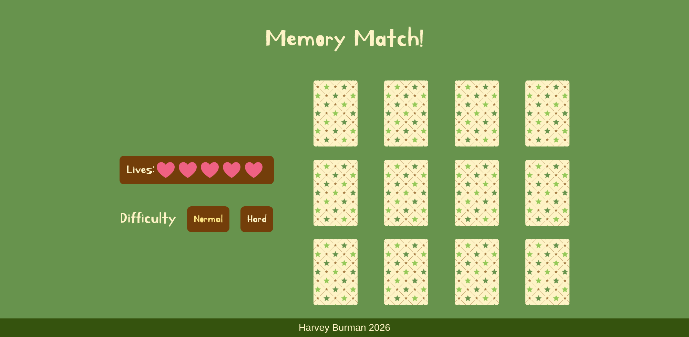

# Memory Match

A React-based card matching memory game.

Live Demo: https://memorymatch-game.vercel.app/  
Frontend Repo: https://github.com/hravv/memory-match  

---

## Table of Contents

- [Overview](#overview)
- [Features](#features)
- [Tech Stack](#tech-stack)
- [Screenshots](#screenshots)
- [Deployment](#deployment)
- [Future Improvements](#future-improvements)
- [Credits](#credits)
- [License](#license)

---

## Overview

### Motivation
I built this project to refine my understanding of state in React. I also took a step forward in my learning of CSS, utilising 3D objects to render each side of a card for a smooth flip animation. 

### Objective
To build a polished game fully playable by anybody using React's state feature.

### Learning Outcomes
- Created functionality for comparison of two values 
- Utilised useRef in a project for the first time
- Created 3D objects
---

## Features

- Fully responsive design
- Smooth animations
- Multiple difficulties

---

## Tech Stack

### Frontend
- React 
- HTML5
- CSS3 / Tailwind
- JavaScript

### Tools
- Git & GitHub
- VS Code
- Motion

## Usage

1. Click a card to select it 
2. Click another to compare icons with
3. Win by matching all pairs of cards before you run out of lives   
4. Choose difficulty via buttons on the left

---

## Screenshots

---

## Deployment

- Frontend deployed on Vercel

---

## Future Improvements

- Add score system
- Add leaderboard system to compare scores with other users (project becomes fullstack)

---

## Credits

Developer: Harvey Burman 
GitHub: https://github.com/hravv  

---

## License

This project is licensed under the MIT License.
